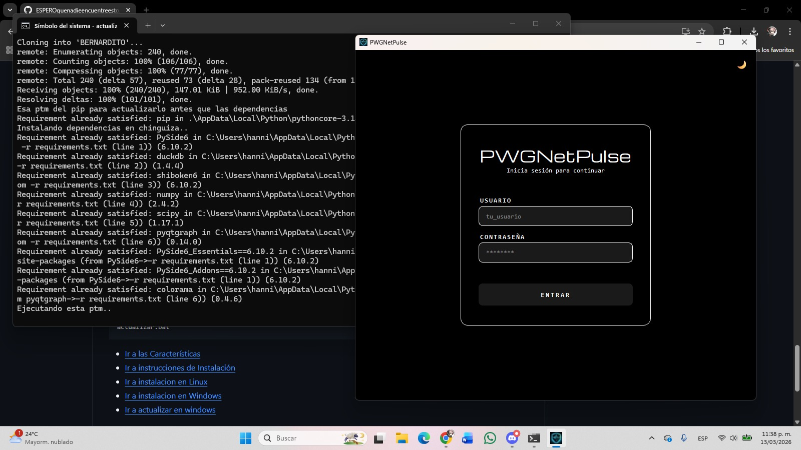
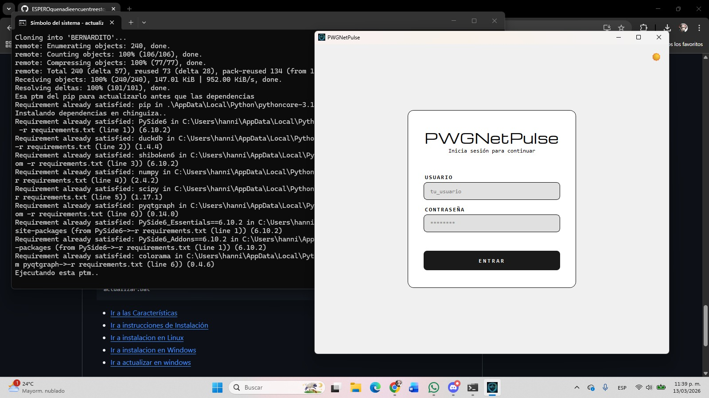

# Mi primer proyecto pijes, esta madre de bernardito esta easy jeje




* [Ir a las Características](#features)
* [Ir a instrucciones de Instalación](#how-to-run-this-bullshit)
* [Ir a instalacion en Linux](#linux)
* [Ir a instalacion en  Windows](#windows)
* [Ir a actualizar en windows](#actualizar-el-repo-para-la-hanniela-que-no-es-colaborador-del-repo)


# *Features*

El uso de datos cambia segun la hora

 Derivada --> Que tan rapido aumenta el trafico de red.
 
 Integral --> Total de datos de red consumidos en el dia.

 Simular el ancho de banda usado por horas. 
 Detectar momentos de saturacion.
 Calcular consumo total.
 Mostrar advertencia si se supera un limite.

APLICACION REAL SEGUN BERNI

Administracion de redes.


# *HOW TO RUN THIS BULLSHIT*

## LINUX

### Family Debian - Ubuntu
```
sudo apt update
sudo apt install git python3
```

### Family Fedora - Red Hat
```
sudo dnf install git python3
```

### Family Arch Linux - Manjaro - EndeavourOS - Garuda Linux- Artix Linux - SteamOS
```
sudo pacman -S git python
```

### Family openSUSE
```
sudo zypper install git python3
```

### Alpine Linux 
```
apk add git python3
```

### Gentoo 
```
emerge --ask dev-vcs/git dev-lang/python
```

### NixOS
```
nix-env -iA nixpkgs.git nixpkgs.python3
```

Descarga la fuente: 

[Michroma font](https://fonts.google.com/specimen/Michroma)

Extrae el archivo y obtén el archivo Michroma-Regular.ttf

Ejecuta

```
mkdir -p ~/.local/share/fonts && cp Michroma-Regular.ttf ~/.local/share/fonts/
```

### Luego clona el repo en fa we:

```
git clone https://github.com/ESPEROquenadieencuentreesto/BERNARDITO.git
```

Metete a la carpeta del repo:

```
cd BERNARDITO
```

Instala las dependencias en chinga: 

```
pip install -r requirements.txt
```

Ejecuta el mainbernardin.py y vas q ver q rollo con el pollo.

```
python3 PWGNetPulse.py
```

## WINDOWS

### Descargar esta madre
Instala el git para windows we:

[Pagina del git](https://git-scm.com/install/)

Descarga la fuente we:

[Michroma font](https://fonts.google.com/specimen/Michroma)

Abre el CMD we:

Ejecuta Windows + r, escribe cmd y pulsa ENTER || Abre el buscador y busca simbolo del sistema y ejecutalo sin ser administrador.

Crea una cuenta de github y guarda tu usuuario y correo para el siguiente paso:

```
git config --global user.name "Tu Nombre"
git config --global user.email "tu@email.com"
```

Clone el repo en fa:

```
git clone https://github.com/ESPEROquenadieencuentreesto/BERNARDITO.git
```

Metete a la carpeta del repo:

```
cd BERNARDITO
```

Instala las dependencias en chinga:

```
py -m pip install -r requirements.txt
```

Ejecuta el main y wacha este pdo:

```
py PWGNetPulse.py
```

### Actualizar el repo para la hanniela que no es colaborador del repo

### Hacer los siuientes pasos solo la primera vez:

Metete al repo en tu explorador de archivos


Saca el actualizar.bat de BERNARDITO a tu carpeta de usuario


### Los siguientes si ya hiciste los primeros pasos la primera vez:


Ejecuta Windows + r, escribe cmd y pulsa ENTER || Abre el buscador y busca simbolo del sistema y ejecutalo sin ser administrador.


Ejecuta el script


```
actualizar.bat
```


* [Ir a las Características](#features)
* [Ir a instrucciones de Instalación](#how-to-run-this-bullshit)
* [Ir a instalacion en Linux](#linux)
* [Ir a instalacion en  Windows](#windows)
* [Ir a actualizar en windows](#actualizar-el-repo-para-la-hanniela-que-no-es-colaborador-del-repo)

#       *Special thanks*
Waldo may que esta en mi equipo jeje

Giovanni aunque casi nos condena a hacer integrales triples para el tambo alvrggg

Su humilde servidor Pedrito jeje
